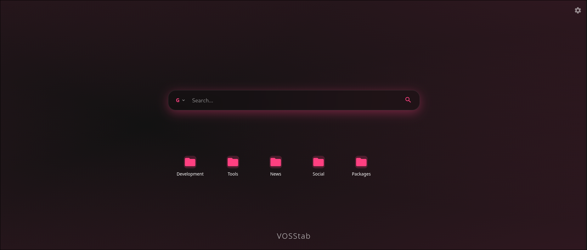
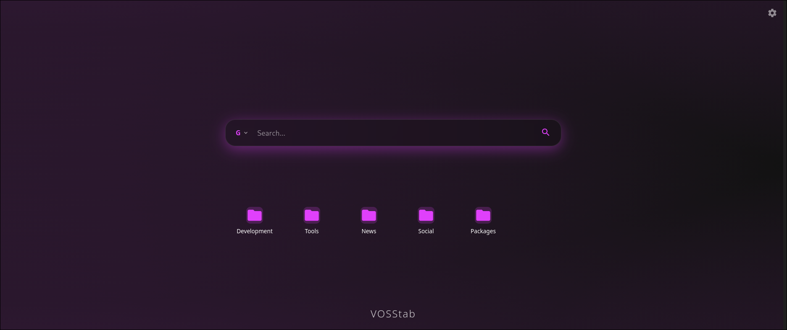
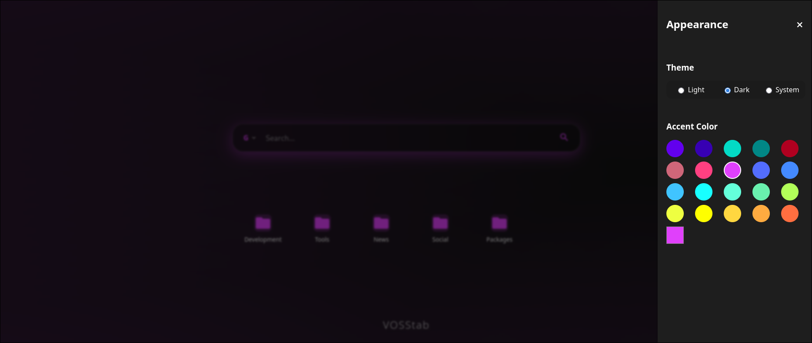

# VOSStab - Expressive New Tab Extension

VOSStab is a highly customizable, modern New Tab page extension built with Vue 3 and Vite. It features a stunning "Expressive Material You" design with dynamic theming, glassy UI elements, and smooth animations to enhance your browsing experience.

## Features

- **Material You Design**: Dynamic color themes that adapt to your preferences.
- **Glassmorphism**: Sleek, modern glassy UI elements for search and menus.
- **Customizable**: Settings drawer to tweak appearance and behavior.
- **Fast & Lightweight**: Built with Vue 3 and Vite for optimal performance.
- **Bookmark Management**: Easy access to your favorite sites.

## Screenshots

<div style="display: flex; flex-direction: column; gap: 20px;">
  
  
  
</div>

## Project Setup

### Compile and Hot-Reload for Development

```sh
npm install
npm run dev
```

### Compile and Minify for Production

```sh
npm run build
```
